# Projet 3 — Migration et sauvegarde d'un poste existant

**Rapport technique d'intervention**

| | |
|---|---|
| **Module** | PPE IT Essentials — CFC 187 |
| **Classe** | E1B — Geneva Institute of Technology |
| **Technicien** | P.G |
| **Date d'intervention** | 15 septembre 2026 |
| **Poste concerné** | `PC01-PG` |
| **Type d'intervention** | Migration Windows 10 → Windows 11 avec sauvegarde et restauration vérifiées |

---

## Table des matières

1. [Contexte et objectif](#1-contexte-et-objectif)
2. [Périmètre et environnement](#2-périmètre-et-environnement)
3. [Méthode : prouver l'intégrité par empreinte SHA-256](#3-méthode--prouver-lintégrité-par-empreinte-sha-256)
4. [Déroulé de l'intervention](#4-déroulé-de-lintervention)
5. [Tableau récapitulatif des commandes](#5-tableau-récapitulatif-des-commandes)
6. [Plan de test et résultats](#6-plan-de-test-et-résultats)
7. [Problèmes rencontrés et solutions apportées](#7-problèmes-rencontrés-et-solutions-apportées)
8. [Écarts constatés et recommandations](#8-écarts-constatés-et-recommandations)
9. [Glossaire](#9-glossaire)
10. [Annexes](#10-annexes)

---

## 1. Contexte et objectif

### 1.1 La situation

Un poste de travail sous **Windows 10 Professionnel 22H2** arrive en fin de vie logicielle. Le support de Windows 10 s'est achevé en octobre 2025 : le poste ne reçoit plus de correctifs de sécurité. Chaque faille découverte depuis cette date reste ouverte de façon permanente sur cette machine.

Ce n'est pas un inconfort, c'est un risque. Un poste non corrigé sur un réseau d'entreprise est un point d'entrée, et sa seule présence peut suffire à faire échouer un audit de conformité.

La décision est donc prise de migrer le poste vers **Windows 11 24H2**. L'utilisateur doit retrouver ses documents et son environnement de travail après l'opération.

### 1.2 Ce qui est réellement demandé

Une migration n'est pas une réinstallation. La réinstallation est la partie facile — elle est automatisée par Microsoft et prend trente minutes sans intervention. Ce qui fait la difficulté du travail, c'est **ce qui doit survivre à l'effacement** :

- les fichiers de l'utilisateur, à l'octet près
- les paramètres qui ne sont pas des fichiers : nom de machine, comptes, réseau, imprimantes, logiciels

Et surtout, ce qui est demandé n'est pas seulement de restaurer, mais de **prouver que la restauration est fidèle**. Dire « j'ai regardé, les fichiers sont revenus » n'est pas une preuve. Ce rapport documente la méthode employée pour en faire une.

### 1.3 Les critères d'évaluation, et ce qu'ils impliquent

| Critère | Poids | Traduction concrète |
|---|---|---|
| Exhaustivité de l'inventaire et de la sauvegarde | 25 % | Avoir listé **tout** ce qui compte — y compris ce qui n'est pas un fichier |
| Qualité de la réinstallation | 20 % | Un système propre et conforme à l'origine, pas un bricolage |
| **Intégrité de la restauration des données** | **30 %** | **Démontrer que les fichiers restaurés sont identiques aux originaux** |
| Clarté et réutilisabilité de la procédure | 25 % | Un document qu'un autre technicien peut appliquer sans son auteur |

Le mot « intégrité » apparaît deux fois dans l'énoncé : à l'étape 3 (vérifier l'intégrité de la sauvegarde) et à l'étape 6 (vérifier l'intégrité après restauration). Ce n'est pas une redondance rédactionnelle — c'est le critère le plus lourd du barème, et il est vérifié deux fois parce qu'une sauvegarde corrompue et une restauration ratée sont deux pannes différentes.

Ce rapport est accompagné d'une **[procédure de migration réutilisable](procedure-migration.md)**, document séparé et autonome, qui répond au critère de réutilisabilité.

---

## 2. Périmètre et environnement

### 2.1 Le poste avant intervention

| Élément | Valeur |
|---|---|
| Nom de machine | `PC01-PG` |
| Système | Windows 10 Professionnel 22H2 — build 19045.6456 |
| Architecture | 64 bits |
| Utilisateur | `tech.pg` (compte local actif) |
| Adressage | `192.168.190.135` — DHCP, passerelle et DNS `192.168.190.2` |
| Disque système | 60 Go (SATA) |
| Micrologiciel | UEFI |

### 2.2 Le poste visé

| Élément | Valeur |
|---|---|
| Système | Windows 11 **Professionnel** 24H2 — build 26100 |
| Nom de machine | `PC01-PG` — **inchangé** |
| Utilisateur | `tech.pg` — **recréé à l'identique** |
| Support de sauvegarde | Disque additionnel 10 Go (NVMe), volume `SAUVEGARDE` |

> **Pourquoi l'édition Professionnelle et pas Famille.** Le poste d'origine était en édition Pro. Passer en Famille aurait été une perte de fonctionnalités pour l'utilisateur : plus de stratégies de sécurité locales (`secpol.msc`), plus de BitLocker, plus de jonction à un domaine. Une migration remplace un système par son équivalent ; elle ne dégrade pas le service rendu. Le choix de l'édition est une décision technique qui se justifie, pas une case à cocher au hasard.

### 2.3 Environnement de virtualisation

L'intervention est menée sur une machine virtuelle VMware Workstation Pro 17. Le « disque externe de sauvegarde » est un second disque virtuel de 10 Go ajouté à la VM — l'équivalent fonctionnel d'un disque USB branché sur un poste physique.

---

## 3. Méthode : prouver l'intégrité par empreinte SHA-256

C'est le cœur du projet. Cette section explique la méthode avant de montrer son application, parce que sans elle les captures qui suivent n'ont pas de sens.

### 3.1 Qu'est-ce qu'une empreinte

Une **empreinte** (ou *hash*, ou *condensat*) est une valeur de longueur fixe calculée à partir du contenu d'un fichier. **SHA-256** produit une empreinte de 256 bits, affichée sous forme de 64 caractères hexadécimaux.

Deux propriétés la rendent utile ici :

- **Déterminisme** — le même contenu produit toujours exactement la même empreinte, sur n'importe quelle machine, à n'importe quel moment
- **Effet d'avalanche** — modifier un seul octet du fichier change complètement l'empreinte, pas seulement un caractère

Exemple relevé sur ce poste :

```
Desktop\A-traiter\todo.txt
C157FF9E7E6463C700DEC4C5B6BC3CB8DF15A02EA48ACB823F2D0AE60E2A61A2
```

### 3.2 Pourquoi pas comparer les tailles ou les dates

C'est la méthode intuitive, et elle ne prouve rien.

| Contrôle | Ce qu'il détecte | Ce qu'il laisse passer |
|---|---|---|
| Nombre de fichiers | un fichier manquant | tout le reste |
| Taille en octets | une troncature | une corruption qui préserve la taille — le cas le plus fréquent |
| Date de modification | rien du tout (elle est copiée avec le fichier) | tout |
| **Empreinte SHA-256** | **toute altération, même d'un seul octet** | — |

Une corruption de copie (secteur défectueux, câble défaillant, coupure en cours d'écriture) laisse très souvent la taille intacte. C'est précisément le cas qu'un contrôle par taille ne verra jamais.

### 3.3 Les trois moments de la vérification

```
   POSTE SOURCE                   SUPPORT                    POSTE MIGRÉ
   (Windows 10)                 DE SAUVEGARDE               (Windows 11)

   [1] inventaire                                          
   inventaire-01-origine.csv                               
        │                                                  
        │  robocopy ────────────► [2] inventaire           
        │                         inventaire-02-sauvegarde.csv
        │                              │                   
        │◄──── comparaison 1 ─────────►│   « 11 fichiers, 0 écart »
        │                              │                   
        │                              │                   
   ══ EFFACEMENT TOTAL DU DISQUE SYSTÈME ══                
   ══ INSTALLATION DE WINDOWS 11         ══                
        │                              │                   
        │                              │  robocopy ───────► [3] inventaire
        │                              │                    inventaire-03-restauration.csv
        │                                                        │
        │◄──────────── comparaison 2 ────────────────────────────►│
                                                        « 11 fichiers, 0 écart »
```

La **comparaison 2** est celle qui compte. Elle confronte l'état d'avant l'effacement à l'état d'après la réinstallation — pas une copie à sa propre copie. Entre les deux, le disque système a été intégralement effacé et le système d'exploitation remplacé.

### 3.4 Pourquoi une empreinte par fichier et non une empreinte globale

Une empreinte unique de l'ensemble répondrait seulement « ça a changé » ou « ça n'a pas changé ». En cas d'écart, le technicien ne saurait pas quel fichier reprendre et devrait tout recommencer.

Avec une empreinte par fichier, la comparaison produit un résultat exploitable en intervention : *« 11 fichiers vérifiés, 1 écart : `baie-brassage.jpg` »*. On sait quoi recopier. C'est la différence entre un voyant rouge et un diagnostic.

### 3.5 Pourquoi un chemin relatif et non un chemin complet

Le même fichier existe successivement à trois emplacements :

```
C:\Users\tech.pg\Documents\rapport.txt          (origine)
E:\Sauvegarde-PC01-PG\Documents\rapport.txt     (sauvegarde)
C:\Users\tech.pg\Documents\rapport.txt          (après restauration)
```

Si l'inventaire enregistrait le chemin complet, les trois relevés seraient incomparables. En enregistrant `Documents\rapport.txt` **par rapport au dossier de départ**, ils deviennent directement confrontables ligne à ligne.

Ce choix s'est révélé indispensable : **la lettre du disque de sauvegarde a changé** au cours de l'intervention, passant de `E:` avant la migration à `D:` après. Avec des chemins absolus, la vérification finale aurait signalé 11 écarts sur 11 fichiers parfaitement intacts. Voir §7.7.

---

## 4. Déroulé de l'intervention

### 4.1 Bloc A — État initial et préparation du support

#### 4.1.1 Relevé de l'état initial

Avant toute action, on établit l'état de départ. Sans ce point de référence, il n'existe aucun moyen de démontrer plus tard que le poste a été rétabli à l'identique — on ne peut prouver un retour à l'origine que si l'origine a été documentée.

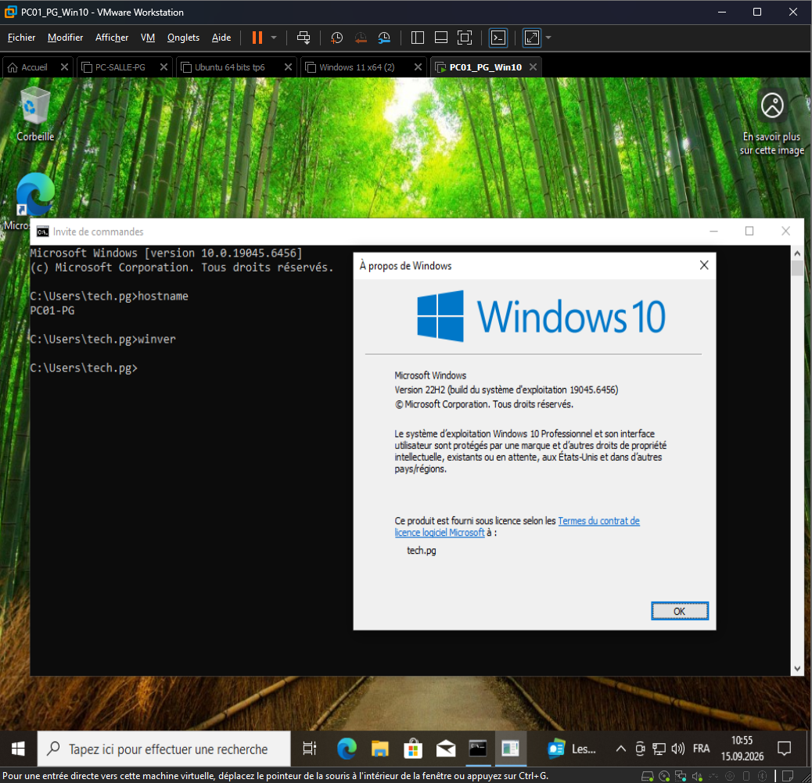

> **Ce que montre cette capture :** le poste `PC01-PG` sous **Windows 10 Professionnel 22H2, build 19045.6456**, avec l'utilisateur `tech.pg` connecté. C'est l'état de départ opposable : édition, version et build sont lisibles, ce qui permettra de vérifier en fin d'intervention que l'édition Professionnelle a bien été conservée.

#### 4.1.2 Constitution des données de test

Le poste ne contenait initialement aucune donnée utilisateur. Une vérification d'intégrité sur un profil vide ne démontrerait rien. Un profil réaliste a donc été reconstitué par script : documents de travail, sous-dossiers métier, et **fichiers binaires**.

La présence de binaires est délibérée. Une vérification qui ne porterait que sur du texte serait peu convaincante : c'est justement sur les fichiers binaires qu'une corruption de copie passe inaperçue à l'œil nu, et SHA-256 s'applique indifféremment à tout type de fichier.

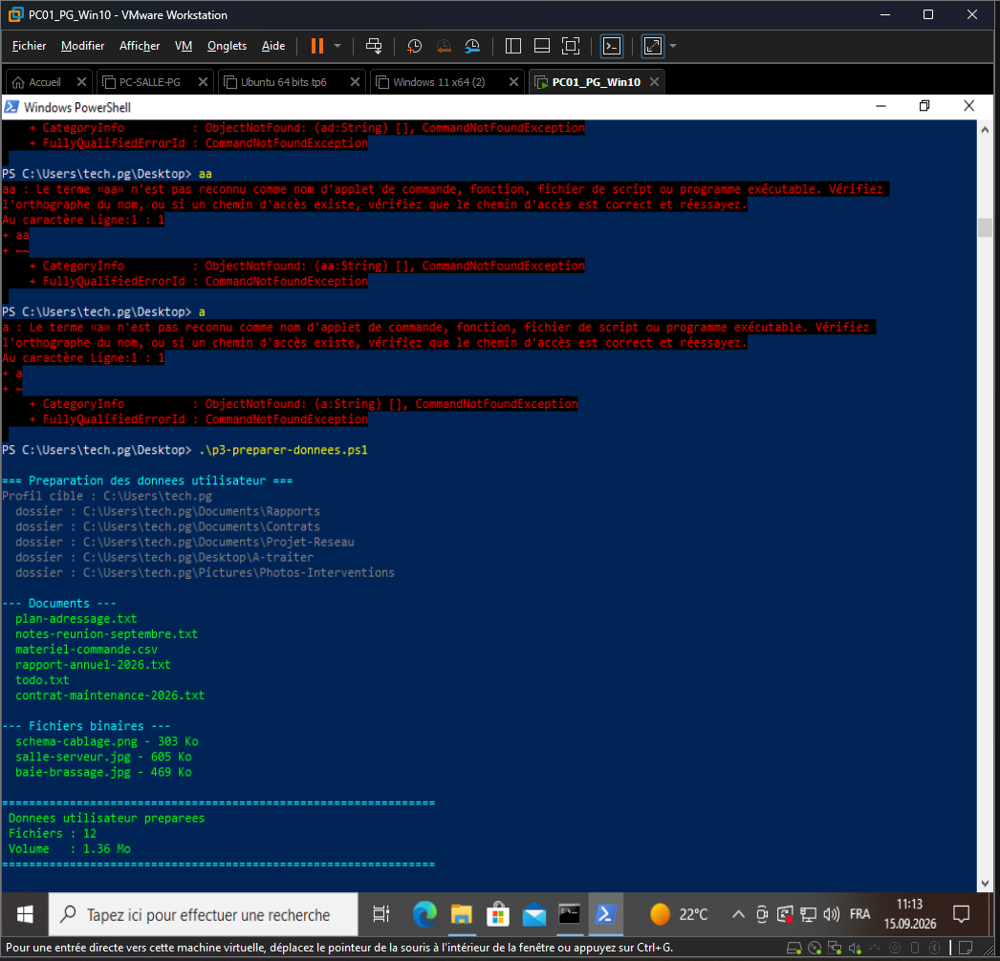

> **Ce que montre cette capture :** l'exécution de `p3-preparer-donnees.ps1` et son récapitulatif — **12 fichiers, 1.36 Mo** créés dans le profil de `tech.pg` : 6 documents texte répartis dans `Documents\Rapports`, `Documents\Contrats`, `Documents\Projet-Reseau` et `Desktop\A-traiter`, plus 3 fichiers binaires dans `Pictures\Photos-Interventions`. C'est le jeu de données qui sera migré et vérifié.

#### 4.1.3 Préparation du support de sauvegarde

Un disque virtuel de 10 Go a été ajouté à la machine, puis partitionné et formaté. Il joue le rôle du disque externe que l'on brancherait sur un poste physique.

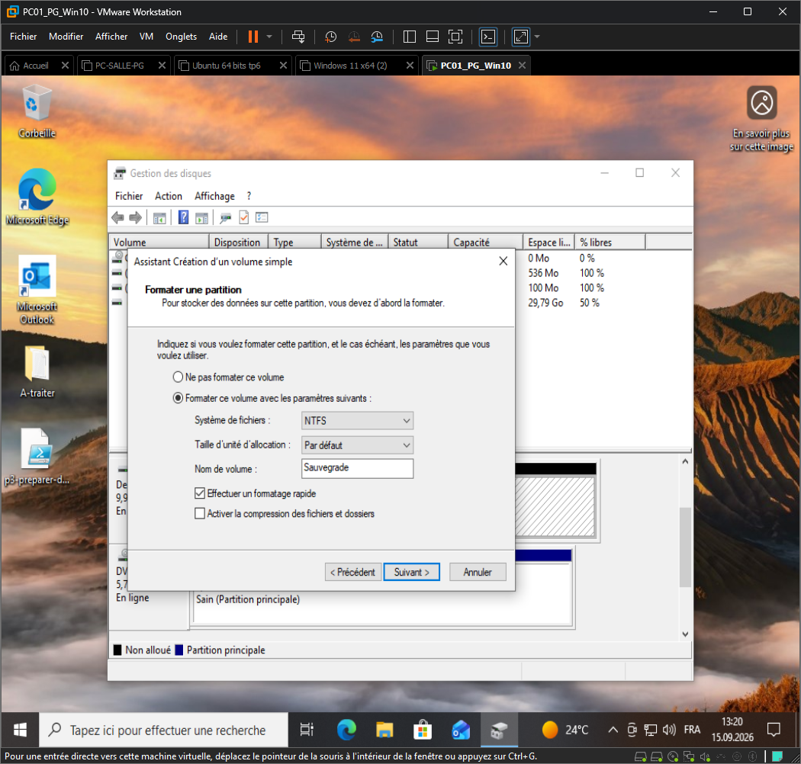

> **Ce que montre cette capture :** dans la Gestion des disques, le `Disque 1` porte désormais un volume **NTFS sain nommé `SAUVEGARDE`, de 10 Go**, monté sous la lettre `E:`. Le support est opérationnel et identifiable — ce dernier point n'est pas cosmétique : au moment du partitionnement de l'installation, c'est le nom du volume qui permet de distinguer le disque à ne pas toucher.
>
> **Choix techniques :** NTFS plutôt que FAT32 (pas de limite à 4 Go par fichier, conservation des permissions) ; formatage rapide (le disque est neuf, aucune donnée à écraser) ; **compression NTFS désactivée** — elle ralentirait chaque lecture et chaque écriture pour un gain nul sur des fichiers déjà compressés, et ajouterait une couche logicielle entre le fichier et le disque sur un support dont la seule qualité recherchée est la fiabilité.

---

### 4.2 Bloc B — Inventaire

#### 4.2.1 Séparer les outils des données

Un premier inventaire a révélé que les scripts de travail, déposés sur le Bureau, étaient comptabilisés comme des données utilisateur (13 fichiers au lieu de 12). Ils ont été déplacés dans `C:\Outils`, hors du profil.

Ce n'est pas un détail de présentation. Un technicien qui laisse ses outils dans les données du client les sauvegarde, les restaure, et les lui rend mélangés à ses propres fichiers. Surtout, un inventaire qui contient le fichier d'inventaire lui-même produit des écarts inexplicables à la comparaison finale.

**Règle appliquée :** outils du technicien dans `C:\Outils`, données du client dans son profil, jamais l'inverse.

#### 4.2.2 Inventaire des fichiers avec empreintes

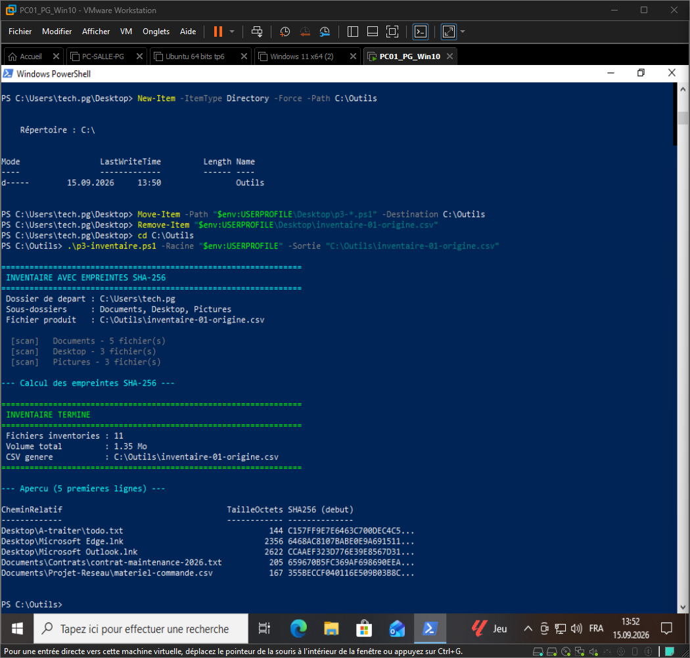

> **Ce que montre cette capture :** le script `p3-inventaire.ps1` parcourt `Documents`, `Desktop` et `Pictures` du profil `tech.pg`, calcule l'empreinte SHA-256 de chaque fichier et produit `inventaire-01-origine.csv`. Le résultat — **11 fichiers, 1.35 Mo** — est l'inventaire de référence de toute l'intervention. L'aperçu des cinq premières lignes montre que ce sont bien des empreintes qui ont été calculées, et non une simple liste de noms.
>
> Les 11 fichiers se répartissent en 5 documents, 3 éléments du Bureau (dont deux raccourcis `.lnk`, qui font partie de l'environnement de l'utilisateur et sont donc conservés) et 3 fichiers binaires.

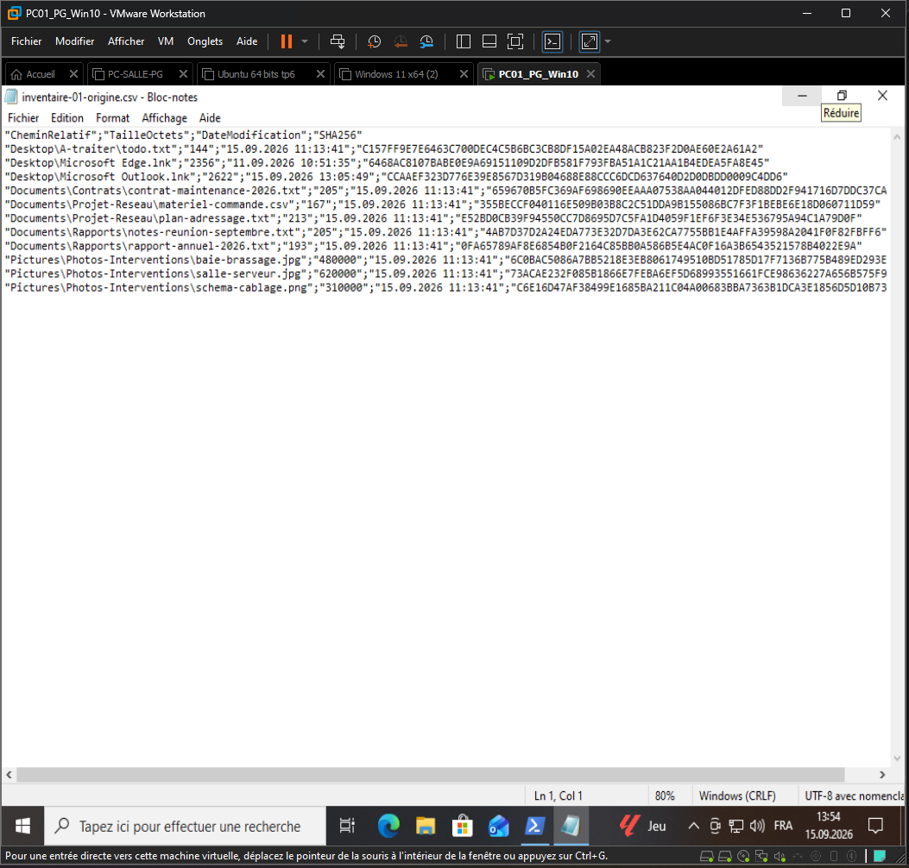

> **Ce que montre cette capture :** le contenu de `inventaire-01-origine.csv`. Chaque ligne comporte le **chemin relatif**, la **taille en octets**, la **date de modification** et l'**empreinte SHA-256 complète** (64 caractères). C'est ce fichier — et non les captures — qui constitue la preuve opposable ; il est joint en annexe du rendu.
>
> Le séparateur retenu est le point-virgule, et non la virgule : c'est le séparateur attendu par Excel en configuration francophone. Avec une virgule, tout le contenu atterrirait dans une seule colonne et le fichier serait illisible pour qui voudrait le vérifier.

#### 4.2.3 Inventaire des configurations

Les fichiers ne représentent qu'une partie de ce qui doit survivre. Le nom de machine, les comptes, l'adressage réseau, les imprimantes et les logiciels installés ne se copient pas — ils se **relèvent**, pour être **recréés** après l'installation.

Ce relevé devait impérativement être fait avant l'effacement. Une fois le disque formaté, ces informations n'existent plus nulle part.

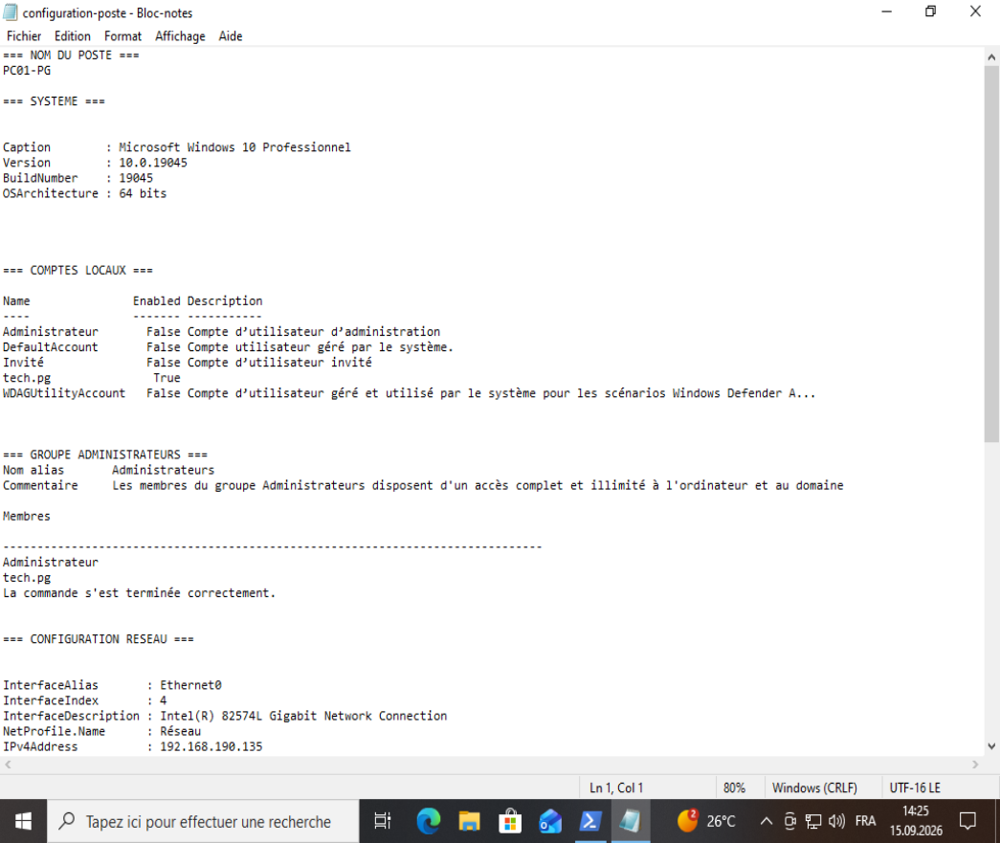

> **Ce que montre cette capture :** le nom du poste `PC01-PG`, le système `Microsoft Windows 10 Professionnel 10.0.19045`, la liste des comptes locaux avec leur état d'activation, la composition du groupe `Administrateurs`, et la configuration réseau (`192.168.190.135`, passerelle et DNS `192.168.190.2`).
>
> **Deux constats directement exploitables.** D'abord, l'adresse `.135` se situe dans la plage DHCP de l'hyperviseur (`.128`–`.254`) : le poste est donc en adressage **automatique**, et non en IP fixe. Rien ne sera à reconfigurer après la migration — mais il fallait le constater, pas le supposer. Ensuite, `tech.pg` figure dans le groupe `Administrateurs` : l'utilisateur est administrateur de sa propre machine. Cet écart est analysé au §8.1.

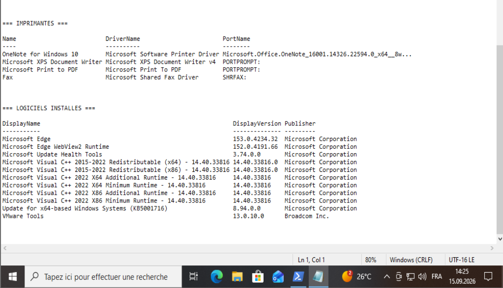

> **Ce que montre cette capture :** les imprimantes déclarées — uniquement les quatre imprimantes virtuelles fournies par Windows (`OneNote`, `XPS Document Writer`, `Print to PDF`, `Fax`), donc **aucune imprimante physique à reconfigurer** — et la liste des logiciels installés avec leur version : Microsoft Edge, Edge WebView2, huit runtimes Visual C++, deux composants de mise à jour Windows 10, et VMware Tools.
>
> **Le poste ne comportait aucun logiciel métier.** Ce constat, établi avant l'effacement, évite de s'interroger après coup sur ce qu'il faudrait réinstaller. Il sera confronté au relevé d'après migration en §4.6.

---

### 4.3 Bloc C — Sauvegarde et première vérification

#### 4.3.1 Copie vers le support

La copie est faite avec `robocopy`, l'outil de copie robuste intégré à Windows, conçu pour les sauvegardes : il reprend après erreur, conserve les horodatages et produit un récapitulatif chiffré exploitable.

Trois appels sont nécessaires car `robocopy` traite un couple source/destination à la fois.

> **Pourquoi ne pas copier le profil entier.** Copier `C:\Users\tech.pg` d'un bloc embarquerait `AppData` — des dizaines de milliers de fichiers de cache, de bases d'applications et de fichiers verrouillés par le système. Ce ne sont pas des données utilisateur, ils ne se restaurent pas sur un autre Windows, et ils feraient exploser la durée de copie sans bénéfice. **On sauvegarde ce qui a de la valeur, pas tout ce qui existe.**

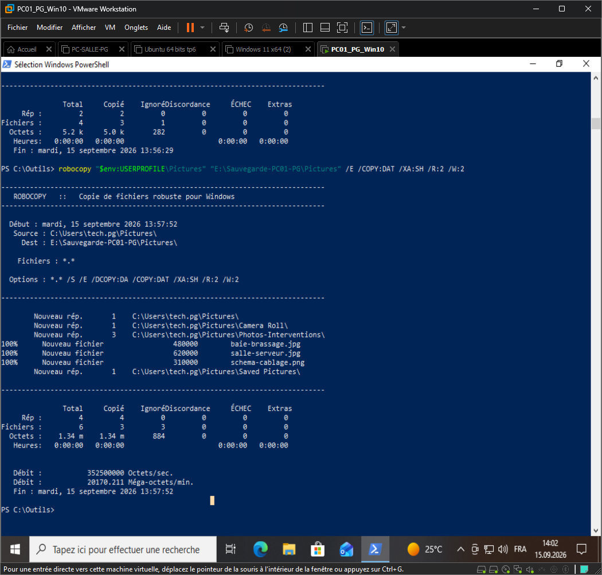

> **Ce que montre cette capture :** le récapitulatif de la troisième copie (`Pictures`) — **3 fichiers copiés, 1.34 Mo, 0 ÉCHEC, 0 discordance**. Les trois fichiers binaires sont listés avec leur taille exacte.
>
> La colonne « Ignoré » affiche 3 : ce sont les fichiers `desktop.ini` cachés de `Camera Roll` et `Saved Pictures`, exclus volontairement par l'option `/XA:SH`. Cette exclusion reproduit exactement celle du script d'inventaire. Sans elle, la sauvegarde contiendrait des fichiers absents de l'inventaire et la comparaison signalerait de faux écarts — **le périmètre de la copie doit être identique au périmètre de l'inventaire, sans quoi la vérification perd son sens.**

#### 4.3.2 Vérification de l'intégrité de la sauvegarde

Un second inventaire est produit, cette fois sur le support de sauvegarde, puis confronté à l'inventaire d'origine.

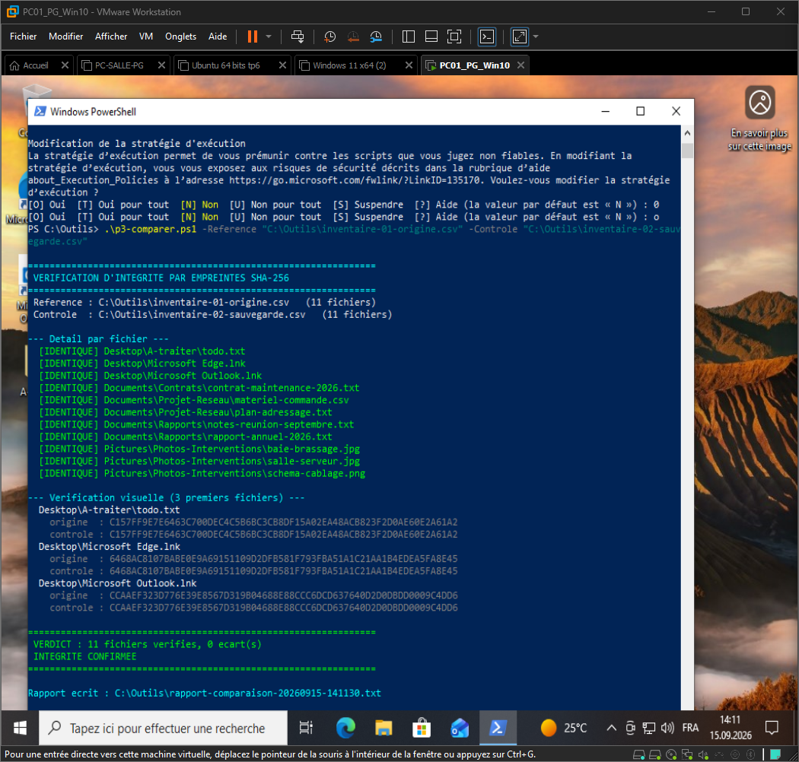

> **Ce que montre cette capture :** la confrontation de `inventaire-01-origine.csv` (11 fichiers) et `inventaire-02-sauvegarde.csv` (11 fichiers). Les onze fichiers apparaissent en `[IDENTIQUE]`. Le bloc « Vérification visuelle » affiche pour trois d'entre eux l'empreinte d'origine et l'empreinte de contrôle, **en entier et côte à côte** — le correcteur peut constater lui-même qu'il s'agit bien de la comparaison de deux empreintes et non d'un compteur.
>
> Le verdict est explicite : **`11 fichiers verifies, 0 ecart(s)` — `INTEGRITE CONFIRMEE`**. La sauvegarde est fidèle à l'original. À ce stade seulement, l'effacement du disque système devient une opération acceptable.
>
> Un rapport texte horodaté est écrit en parallèle dans `C:\Outils\` et joint en annexe : la capture prouve que le contrôle a eu lieu, le rapport en conserve la trace écrite.

---

### 4.4 Bloc D — Réinstallation

#### 4.4.1 Protection du support avant l'opération destructrice

**La règle professionnelle :** le support de sauvegarde n'est connecté que pendant la sauvegarde et pendant la restauration. Jamais pendant l'installation.

La raison est simple. À l'écran de partitionnement, l'installateur de Windows affiche **tous les disques visibles**. Un technicien pressé qui efface le mauvais détruit la sauvegarde qu'il vient de réaliser, et il ne reste plus rien. C'est l'accident classique des migrations, et il est irréversible.

L'application de cette règle s'est heurtée à une contrainte technique de l'environnement.

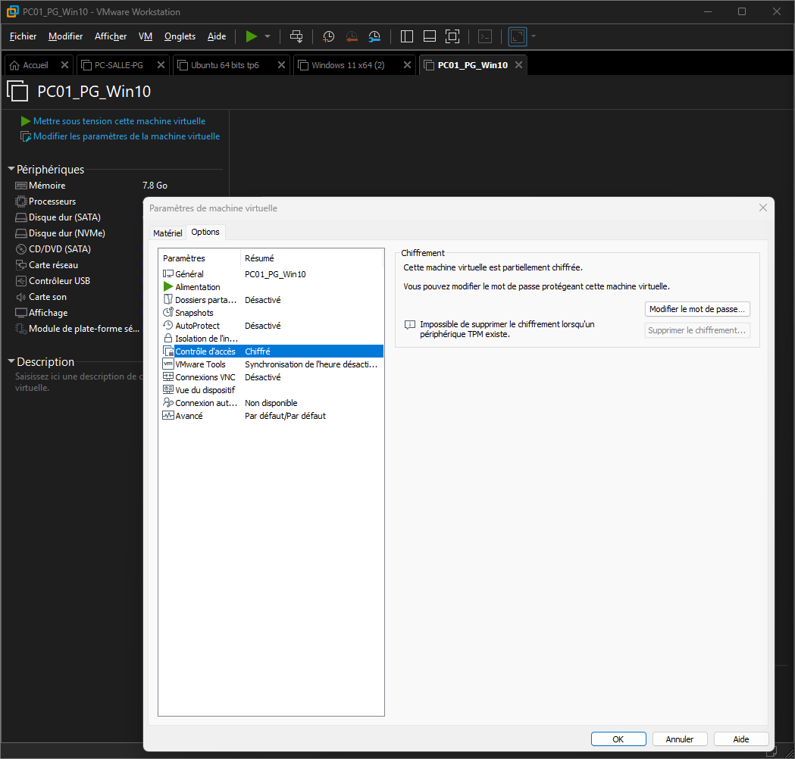

> **Ce que montre cette capture :** l'onglet `Options > Contrôle d'accès` de la machine virtuelle. VMware indique : **« Cette machine virtuelle est partiellement chiffrée »** et **« Impossible de supprimer le chiffrement lorsqu'un périphérique TPM existe »**. Le bouton de retrait de matériel est verrouillé.
>
> **La chaîne de dépendances est la suivante :** Windows 11 exige un TPM → VMware n'expose un vTPM que sur une machine chiffrée → le chiffrement verrouille la modification du matériel. Retirer le disque de sauvegarde aurait supposé de retirer le chiffrement, donc le TPM, donc la condition qui rend l'installation de Windows 11 possible. **Les deux exigences sont incompatibles dans cet environnement.**

**Mesure compensatoire retenue.** Le principe de sécurité n'est pas « débrancher le câble », il est **« la sauvegarde ne doit pas se trouver au même endroit que l'opération risquée »**. Le disque de sauvegarde étant un fichier unique sur la machine hôte (`PC01_PG_Win10-1.vmdk`), une copie de ce fichier a été placée hors du dossier de la machine virtuelle.

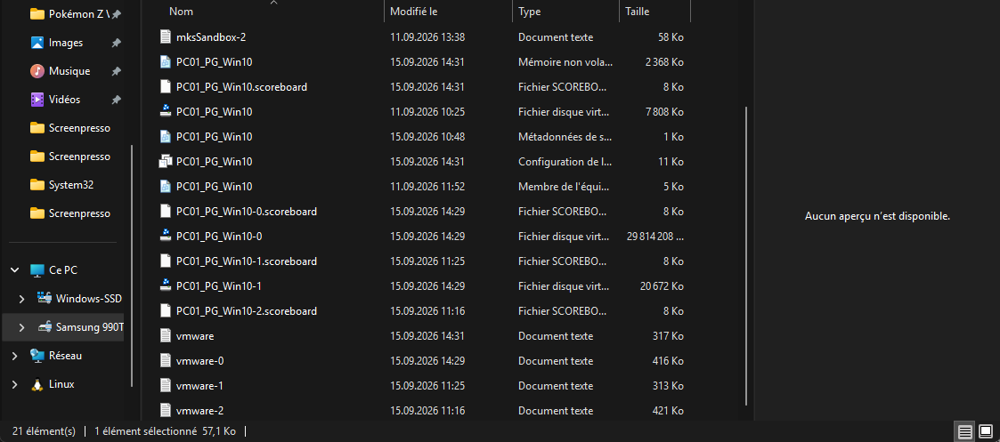

> **Ce que montre cette capture :** le dossier de la machine virtuelle. Le fichier `PC01_PG_Win10-1` (**20 672 Ko**) est le disque de sauvegarde, toujours en place et rattaché à la VM — indispensable, son déplacement empêcherait la machine de démarrer.

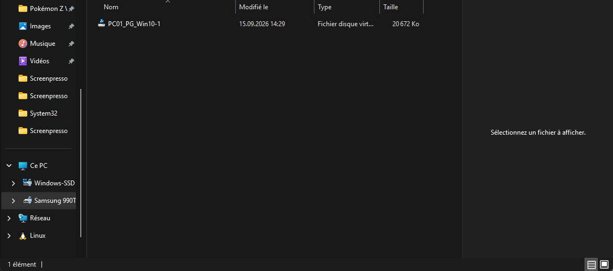

> **Ce que montre cette capture :** le dossier `_sauvegarde-P3`, à l'extérieur du dossier de la VM, contenant une copie du même fichier de 20 672 Ko. À partir de cet instant, même une erreur de partitionnement destructrice serait réversible : il suffirait de remettre ce fichier en place.
>
> La contrainte est documentée, la mesure compensatoire est tracée, et le principe professionnel est respecté — seule sa mise en œuvre diffère.

#### 4.4.2 Partitionnement

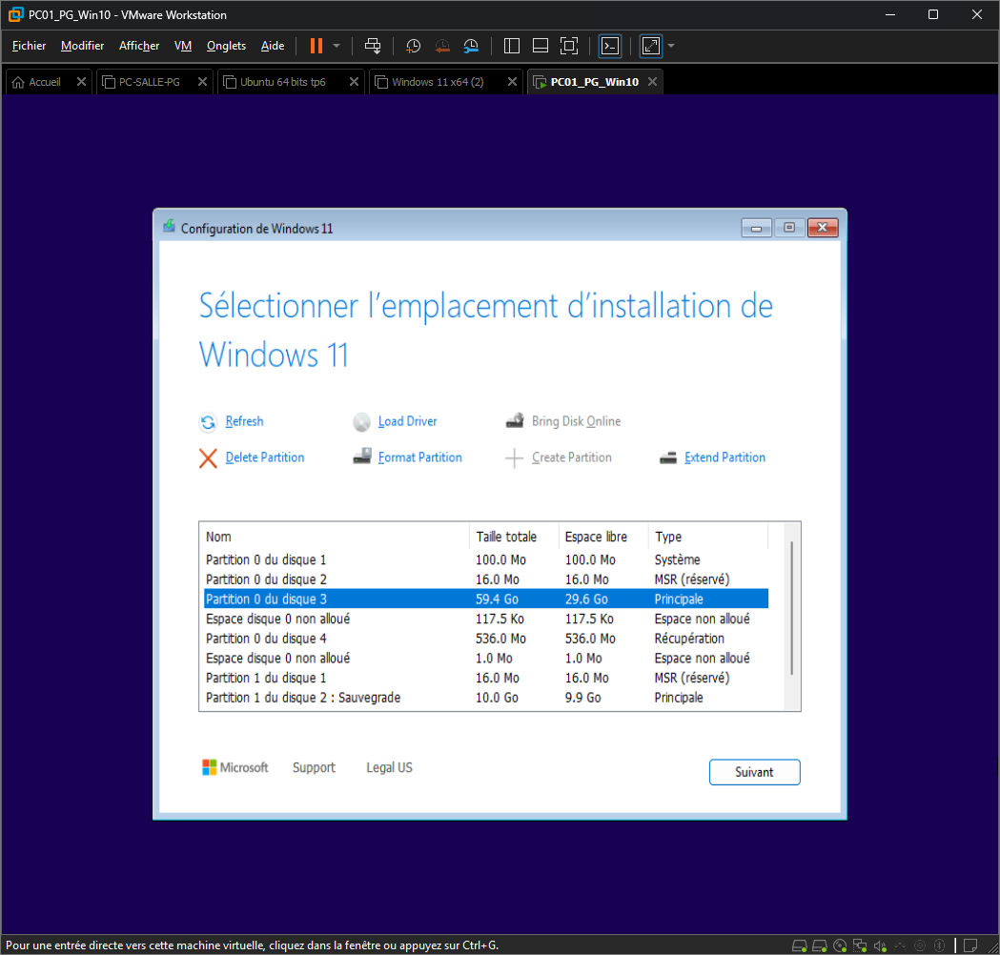

> **Ce que montre cette capture :** l'écran « Sélectionner l'emplacement d'installation », **avant toute suppression**. Huit lignes y figurent, réparties sur deux disques.
>
> **Attention au libellé français, qui est une traduction fautive de Microsoft :** « Partition 0 du disque 3 » signifie en réalité *disque 0, partition 3*. La lecture correcte est donc :
>
> | Ligne | Disque | Rôle |
> |---|---|---|
> | `Partition 0 du disque 1` — 100 Mo, Système | disque 0 | partition EFI |
> | `Partition 0 du disque 2` — 16 Mo, MSR | disque 0 | réservée Microsoft |
> | `Partition 0 du disque 3` — 59.4 Go, Principale | disque 0 | **Windows 10** |
> | `Partition 0 du disque 4` — 536 Mo, Récupération | disque 0 | environnement de récupération |
> | `Partition 1 du disque 1` — 16 Mo, MSR | **disque 1** | **support de sauvegarde** |
> | `Partition 1 du disque 2 : Sauvegrade` — 10 Go | **disque 1** | **support de sauvegarde** |
>
> Le nom de volume visible sur la dernière ligne est ce qui permet de l'identifier sans ambiguïté au milieu des autres. C'est la raison pratique pour laquelle un support de sauvegarde se nomme explicitement.

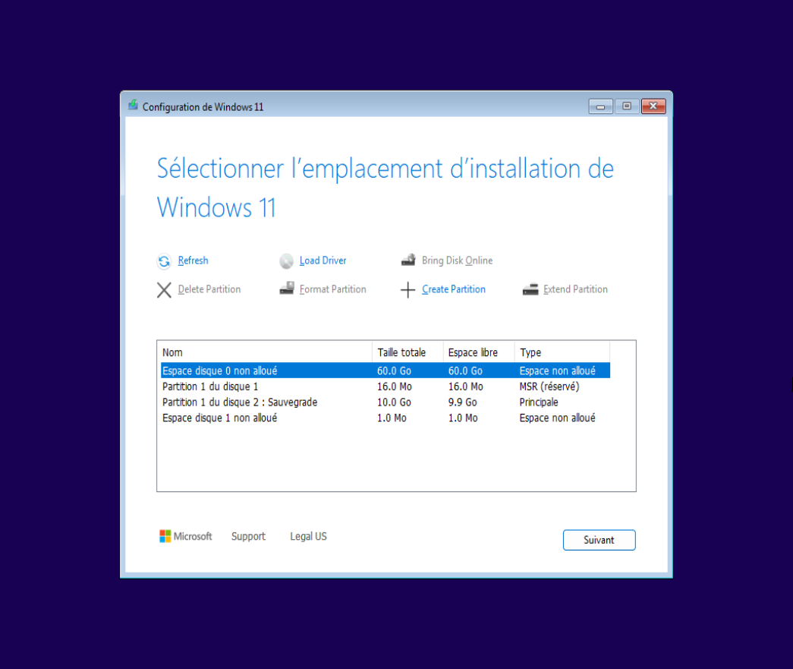

> **Ce que montre cette capture :** après suppression des quatre partitions du disque 0, il ne reste que `Espace disque 0 non alloué — 60.0 Go`. Sur la même image, `Partition 1 du disque 2 : Sauvegrade — 10.0 Go, 9.9 Go libres` est toujours présente et intacte.
>
> **C'est la preuve la plus directe du bloc :** le disque système a été intégralement vidé, et le support de sauvegarde n'a pas été touché. Les deux faits sont établis par une seule image, prise au moment où ils étaient simultanément vérifiables.

#### 4.4.3 Installation et remise en conformité

L'installation a été menée en mode **« Personnalisée : installer uniquement Windows »**, et non en mise à niveau : l'objectif est un système propre, pas un système qui hérite des résidus du précédent.

Le compte local `tech.pg` a été recréé pendant la configuration initiale, puis le poste renommé.

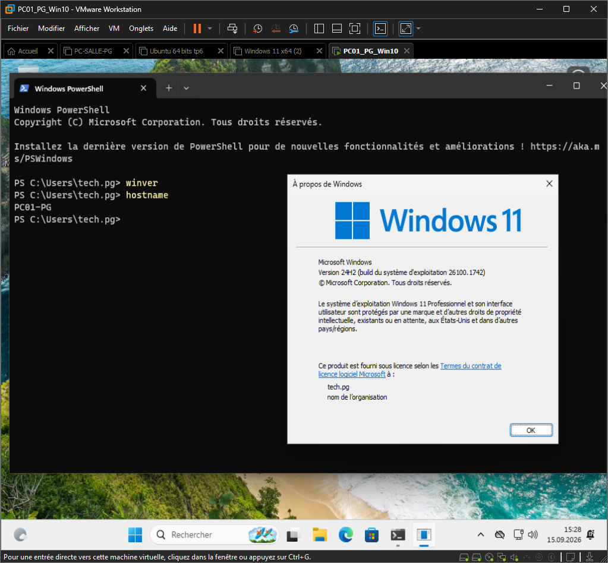

> **Ce que montre cette capture :** trois informations sur une seule image. `winver` indique **Windows 11 Professionnel, version 24H2, build 26100.1742**. La commande `hostname` retourne **`PC01-PG`**. L'invite PowerShell affiche `C:\Users\tech.pg`.
>
> L'édition **Professionnelle** est conservée, conformément au poste d'origine. Le nom de machine est identique — ce n'est pas cosmétique : un poste qui revient sur le réseau sous un autre nom n'est plus reconnu par l'inventaire de l'entreprise, ni par les partages, ni par les stratégies qui le ciblent.

---

### 4.5 Bloc E — Restauration et vérification finale

#### 4.5.1 Restauration des données

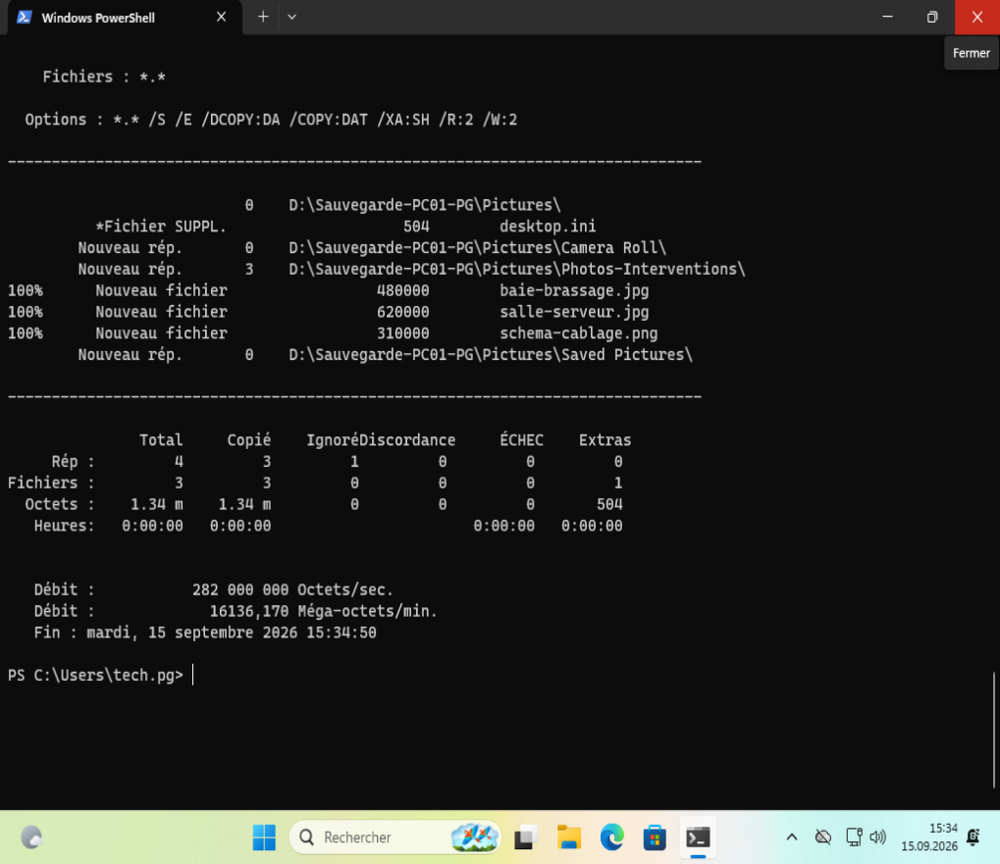

> **Ce que montre cette capture :** le récapitulatif de la restauration de `Pictures` depuis `D:\Sauvegarde-PC01-PG\` vers le profil de `tech.pg` — **3 fichiers, 1.34 Mo, 0 ÉCHEC**. Les mêmes options `robocopy` que pour la sauvegarde sont employées, de sorte que le périmètre reste rigoureusement identique dans les deux sens.
>
> La mention `*Fichier SUPPL. desktop.ini` signale un fichier présent à la destination et absent de la source : c'est un fichier système créé par Windows 11 lui-même. Il est caché, donc hors du périmètre d'inventaire, et n'interfère pas avec la vérification.

#### 4.5.2 Vérification d'intégrité après restauration

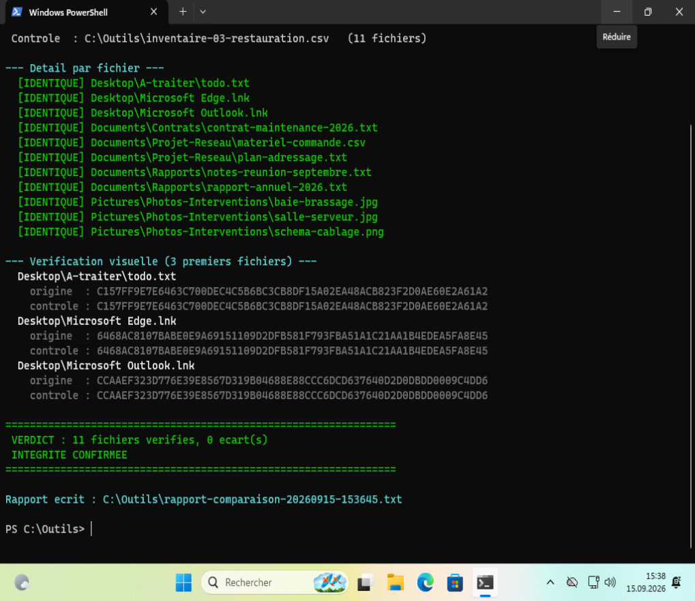

> **Ce que montre cette capture — la pièce maîtresse du dossier.** La confrontation de `inventaire-01-origine.csv`, relevé **avant l'effacement**, et de `inventaire-03-restauration.csv`, relevé **après la réinstallation complète du système**.
>
> Les onze fichiers apparaissent en `[IDENTIQUE]` : les trois documents du Bureau, les cinq documents, les trois fichiers binaires. Le bloc de vérification visuelle affiche trois paires d'empreintes complètes, identiques caractère par caractère sur 64 caractères. Le verdict est **`11 fichiers verifies, 0 ecart(s)` — `INTEGRITE CONFIRMEE`**.
>
> **Ce qui sépare les deux inventaires comparés ici :** la suppression des quatre partitions du disque système, l'installation complète de Windows 11, la recréation du compte utilisateur, et un changement de lettre du support de sauvegarde. Après tout cela, les onze empreintes sont inchangées.
>
> L'intégrité de la restauration n'est pas affirmée — elle est **démontrée**, fichier par fichier, avec un verdict calculé et un rapport horodaté à l'appui.

#### 4.5.3 Contrôle d'usage

Une empreinte identique prouve que les octets sont les mêmes. Elle ne prouve pas que l'utilisateur peut travailler : un fichier peut être intact et inaccessible faute de permissions, ou ouvert par la mauvaise application. Un contrôle d'usage complète donc le contrôle technique.

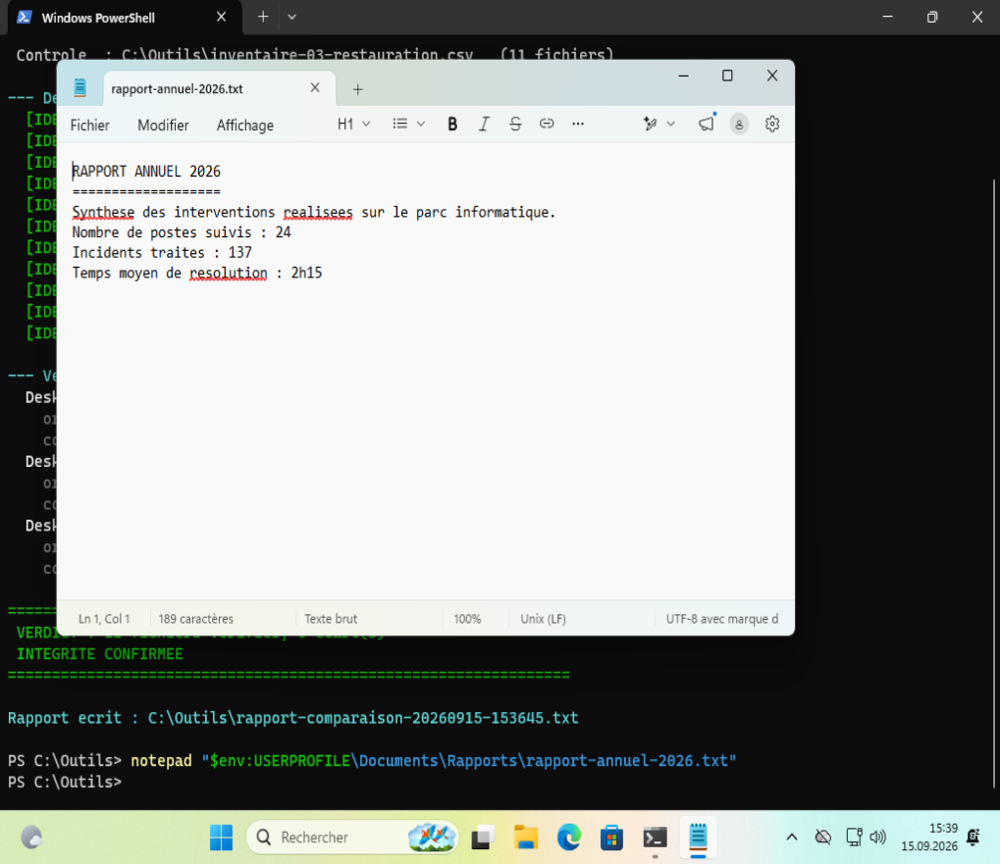

> **Ce que montre cette capture :** `rapport-annuel-2026.txt`, restauré depuis la sauvegarde, ouvert dans le Bloc-notes et parfaitement lisible — avec le verdict `INTEGRITE CONFIRMEE` toujours visible en arrière-plan. Les deux niveaux de preuve, technique et fonctionnel, tiennent sur la même image.
>
> **Précision de méthode :** le fichier choisi est un document texte. Les trois fichiers de `Photos-Interventions` portent des extensions `.jpg` et `.png` mais contiennent des octets générés aléatoirement — ils ne s'ouvrent pas comme des images. Ils n'ont jamais eu vocation à être affichés : leur rôle était de démontrer que la vérification d'intégrité s'applique aussi à du contenu binaire, ce qu'un jeu de fichiers texte seul n'aurait pas établi. Ce point est signalé plutôt que dissimulé.

---

### 4.6 Bloc F — Contrôle de l'environnement rétabli

Le relevé de configuration produit avant l'effacement (§4.2.3) est reproduit à l'identique sur le poste migré, puis confronté ligne à ligne.

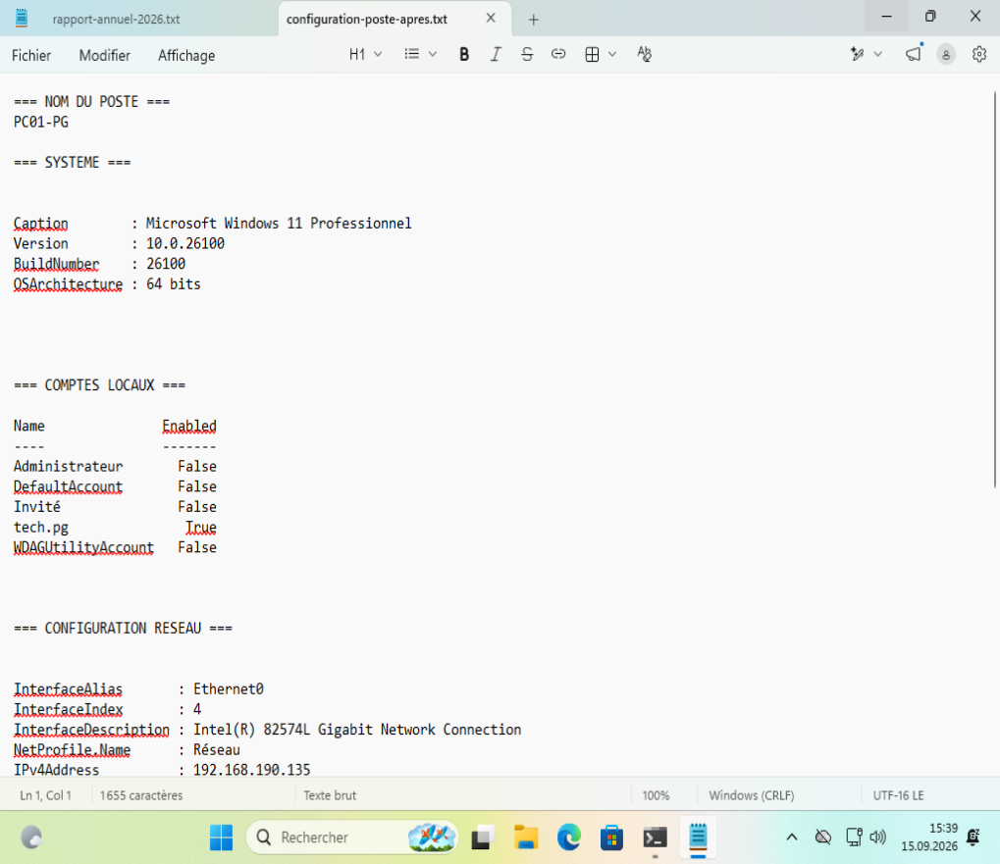

> **Ce que montre cette capture :** nom du poste **`PC01-PG`**, système **Windows 11 Professionnel 10.0.26100**, comptes locaux avec `tech.pg` actif, et adressage réseau.
>
> **L'adresse IPv4 est `192.168.190.135` — exactement celle relevée avant la migration.** Le serveur DHCP a réattribué le même bail. Ce n'est pas un paramètre qui a été reconfiguré, c'est un résultat qui a été constaté : dans un rapport d'intervention, la distinction a son importance.

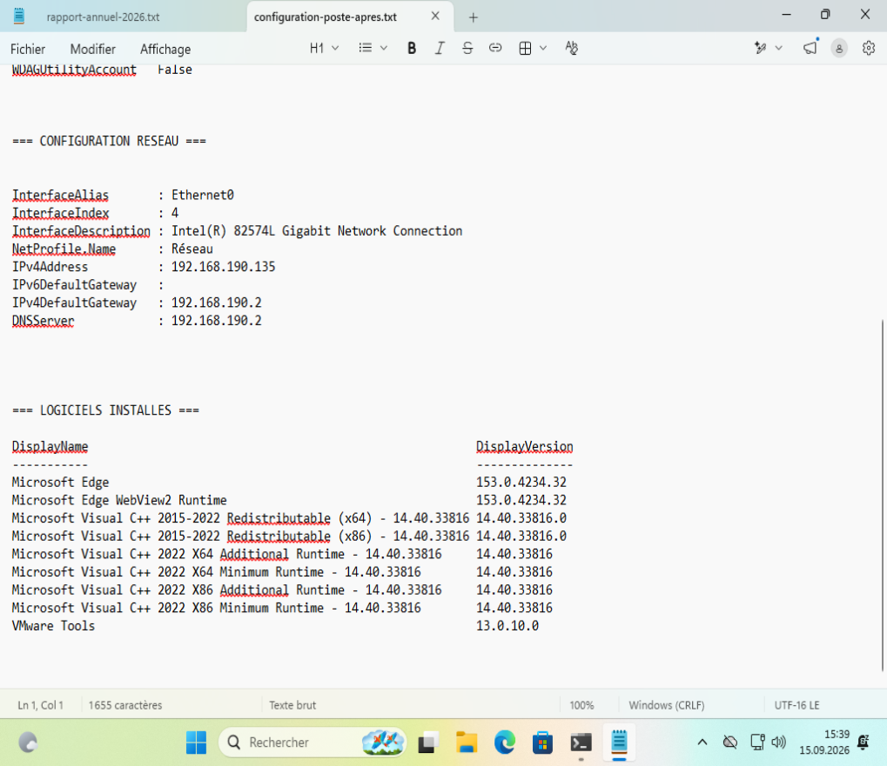

> **Ce que montre cette capture :** la passerelle `192.168.190.2` et le DNS `192.168.190.2`, identiques à l'origine, puis la liste des logiciels installés.
>
> **Confrontation avec le relevé d'avant migration :**
>
> | Logiciel | Avant (Win 10) | Après (Win 11) |
> |---|---|---|
> | Microsoft Edge | 153.0.4234.32 | 153.0.4234.32 ✔ |
> | Microsoft Edge WebView2 Runtime | 152.0.4191.66 | 153.0.4234.32 ✔ |
> | Visual C++ 2015-2022 Redistributable (x64/x86) | 14.40.33816 | 14.40.33816 ✔ |
> | Visual C++ 2022 — 6 runtimes | 14.40.33816 | 14.40.33816 ✔ |
> | VMware Tools | 13.0.10.0 | 13.0.10.0 ✔ |
> | Microsoft Update Health Tools | 3.74.0.0 | absent — voir ci-dessous |
> | Update for x64-based Windows Systems (KB5001716) | 8.94.0.0 | absent — voir ci-dessous |
>
> Les deux seules absences sont des **composants de maintenance propres à Windows 10**. `Microsoft Update Health Tools` et le correctif `KB5001716` servaient à réparer le service de mise à jour de Windows 10 ; Windows 11 intègre leurs équivalents dans le système et ne les installe pas séparément. Leur absence est le comportement attendu, et non une régression.
>
> **Aucun logiciel métier n'était installé sur le poste d'origine** — le relevé du §4.2.3 l'établissait. Il n'y avait donc rien à réinstaller, et l'environnement de travail est rétabli à l'identique.

---

## 5. Tableau récapitulatif des commandes

### 5.1 Inventaire et vérification

| Commande | Rôle | Points d'attention |
|---|---|---|
| `Get-FileHash -Algorithm SHA256` | calcule l'empreinte d'un fichier | l'algorithme doit être le même aux trois relevés ; SHA-256 est le standard actuel |
| `Get-ChildItem -Recurse -File` | énumère les fichiers d'une arborescence | **sans** `-Force`, pour exclure les fichiers cachés — le périmètre doit être reproductible |
| `Export-Csv -Delimiter ';'` | écrit le CSV | point-virgule : séparateur attendu par Excel en configuration francophone |
| `Import-Csv -Delimiter ';'` | relit le CSV pour la comparaison | doit employer le même séparateur que l'export |
| `.Substring($Racine.Length + 1)` | convertit un chemin absolu en chemin relatif | c'est ce qui rend les inventaires comparables entre disques |

### 5.2 Copie

| Commande | Rôle |
|---|---|
| `robocopy <source> <dest> /E /COPY:DAT /XA:SH /R:2 /W:2` | copie robuste d'un dossier |

| Option | Effet | Pourquoi ici |
|---|---|---|
| `/E` | copie les sous-dossiers, même vides | conserve l'arborescence à l'identique |
| `/COPY:DAT` | copie **D**onnées, **A**ttributs, **T**imestamps | la date de modification doit survivre à la migration |
| `/XA:SH` | exclut les fichiers **S**ystème et cachés (**H**idden) | reproduit exactement le périmètre du script d'inventaire |
| `/R:2` | 2 tentatives en cas d'erreur | par défaut `robocopy` réessaie **un million de fois** et bloque indéfiniment sur un fichier verrouillé |
| `/W:2` | 2 secondes entre deux tentatives | idem, la valeur par défaut est de 30 secondes |

> **Codes de retour de `robocopy` :** `0` = rien à faire, `1` = des fichiers ont été copiés avec succès, `≥ 8` = erreur réelle. Un code `1` n'est pas un échec — c'est une particularité de l'outil qui déroute souvent.

### 5.3 Relevé de configuration

| Commande | Ce qu'elle relève |
|---|---|
| `hostname` | nom de la machine |
| `Get-CimInstance Win32_OperatingSystem` | édition, version, build, architecture |
| `Get-LocalUser` | comptes locaux et leur état d'activation |
| `net localgroup Administrateurs` | composition du groupe d'administration |
| `Get-NetIPConfiguration` | adresse IP, passerelle, DNS |
| `Get-Printer` | imprimantes, pilotes et ports |
| `Get-ItemProperty HKLM:\...\Uninstall\*` | logiciels installés, via le registre |

> **Pourquoi lire le registre pour les logiciels plutôt que `Get-Package` :** les clés `Uninstall` (branches 64 bits et `WOW6432Node` pour les applications 32 bits) constituent la source de vérité utilisée par le Panneau de configuration lui-même. Elles retournent la même liste que celle que verrait l'utilisateur, versions comprises.

### 5.4 Administration système

| Commande | Rôle | Point d'attention |
|---|---|---|
| `Rename-Computer -NewName "PC01-PG" -Restart` | renomme la machine | **nécessite une console élevée** — voir §7.5 |
| `Set-ExecutionPolicy -Scope Process -ExecutionPolicy Bypass` | autorise l'exécution de scripts | `-Scope Process` : valable pour la seule fenêtre ouverte — voir §7.2 |
| `Get-Volume` | liste les volumes et leurs lettres | indispensable après une réinstallation — les lettres changent |
| `start ms-cxh:localonly` | ouvre la création de compte local pendant l'OOBE | voir §7.4 |

---

## 6. Plan de test et résultats

| # | Test | Méthode | Résultat attendu | Résultat obtenu | Preuve |
|---|---|---|---|---|---|
| T1 | Le support de sauvegarde est opérationnel | Gestion des disques | Volume NTFS sain, lettre attribuée | `SAUVEGARDE (E:)`, NTFS, Sain | Capture 03 |
| T2 | L'inventaire couvre toutes les données utilisateur | `p3-inventaire.ps1` sur le profil | Tous les fichiers de Documents, Desktop, Pictures | 11 fichiers, 1.35 Mo | Captures 04, 05 |
| T3 | L'inventaire produit bien des empreintes | Lecture du CSV | 64 caractères hexadécimaux par fichier | Conforme | Capture 05 |
| T4 | La configuration non-fichier est relevée | Script de relevé | Nom, comptes, réseau, imprimantes, logiciels | Conforme | Captures 07b-1, 07b-2 |
| T5 | La copie vers le support n'a pas échoué | Récapitulatif `robocopy` | 0 ÉCHEC, 0 discordance | 0 ÉCHEC, 0 discordance | Capture 06 |
| T6 | **La sauvegarde est fidèle à l'original** | `p3-comparer.ps1` (01 vs 02) | 11 identiques, 0 écart | **11 vérifiés, 0 écart** | **Capture 07** |
| T7 | La sauvegarde est protégée pendant l'opération risquée | Copie hors VM | Fichier présent aux deux emplacements | Conforme | Captures 08b-1, 08b-2 |
| T8 | Le disque système est intégralement effacé | Écran de partitionnement | 60 Go non alloués | 60.0 Go non alloués | Capture 09b |
| T9 | Le support de sauvegarde n'a pas été touché | Écran de partitionnement | Volume 10 Go toujours présent | 10.0 Go, 9.9 Go libres | Capture 09b |
| T10 | Le système installé est conforme à l'origine | `winver` | Windows 11 **Professionnel** | Windows 11 Professionnel 24H2 | Capture 10 |
| T11 | Le nom de machine est rétabli | `hostname` | `PC01-PG` | `PC01-PG` | Capture 10 |
| T12 | La restauration n'a pas échoué | Récapitulatif `robocopy` | 0 ÉCHEC | 0 ÉCHEC | Capture 11 |
| T13 | **Les données restaurées sont identiques aux originales** | `p3-comparer.ps1` (01 vs 03) | 11 identiques, 0 écart | **11 vérifiés, 0 écart** | **Capture 12** |
| T14 | Les données restaurées sont exploitables | Ouverture d'un fichier | Contenu lisible | Contenu lisible | Capture 13 |
| T15 | L'environnement logiciel est rétabli | Confrontation des relevés | Mêmes logiciels | Conforme (2 composants Win 10 obsolètes en moins, documentés) | Captures 14a, 14b |
| T16 | La configuration réseau est rétablie | `Get-NetIPConfiguration` | Connectivité fonctionnelle | Même IP, même passerelle, même DNS | Capture 14a |

**16 tests, 16 conformes.**

---

## 7. Problèmes rencontrés et solutions apportées

Cette section documente les blocages réels de l'intervention. Ils font partie du travail : une procédure qui ne les mentionne pas laisse le technicien suivant les redécouvrir un par un.

### 7.1 Le disque additionnel apparaissait déjà initialisé

**Symptôme.** L'option « Initialiser le disque » attendue dans la Gestion des disques était introuvable.

**Diagnostic.** Le disque affichait `De base` / `En ligne` avec une bande noire « Non alloué ». Un disque réellement non initialisé s'affiche « Inconnu / Non initialisé ». VMware l'avait initialisé automatiquement à l'ajout.

**Résolution.** Étape sautée, passage direct à la création du volume simple.

**À retenir.** Lire l'état affiché avant de chercher l'option attendue. Une étape manquante n'est pas toujours une étape ratée.

### 7.2 Blocage de l'exécution des scripts PowerShell

**Symptôme.** `Impossible de charger le fichier [...] car l'exécution de scripts est désactivée sur ce système.`

**Diagnostic.** Windows bloque par défaut l'exécution de scripts, pour éviter qu'un fichier reçu par courriel s'exécute d'un double-clic.

**Résolution.** `Set-ExecutionPolicy -Scope Process -ExecutionPolicy Bypass` — l'autorisation ne vaut que pour la fenêtre en cours.

**À retenir.** `-Scope Process` est volontairement non persistant : **la commande est à retaper à chaque nouvelle console**. C'est ce qui explique que l'erreur soit réapparue trois fois au cours de l'intervention, y compris sur le système fraîchement installé. Le problème n'est pas résolu une fois pour toutes, et c'est voulu — on ne désactive pas durablement une protection pour la commodité d'une intervention.

### 7.3 Script introuvable malgré sa présence

**Symptôme.** `.\p3-inventaire.ps1 : le terme n'est pas reconnu`, alors que le fichier était visible sur le Bureau.

**Diagnostic.** L'invite indiquait `C:\Users\tech.pg` et non `C:\Users\tech.pg\Desktop`. Le préfixe `.\` désigne le **dossier courant** ; PowerShell cherchait au mauvais endroit.

**Résolution.** `cd` vers le dossier contenant le script.

**À retenir.** Sous PowerShell, le `.\` est obligatoire pour lancer un script du dossier courant — mesure de sécurité empêchant qu'un fichier déposé dans un dossier remplace silencieusement une commande système du même nom.

### 7.4 Windows 11 24H2 impose un compte Microsoft

**Symptôme.** La configuration initiale ne proposait aucune option de compte local.

**Diagnostic.** Microsoft a retiré l'ancien contournement `oobe\bypassnro` de la version 24H2.

**Résolution.** `Maj` + `F10` pour ouvrir une invite de commandes, puis `start ms-cxh:localonly`, qui ouvre l'assistant de création de compte local.

**À retenir.** Ce contournement est spécifique à 24H2. Les procédures rédigées pour les versions antérieures sont périmées sur ce point — une raison de plus pour dater une procédure d'installation.

### 7.5 « Accès refusé » au renommage du poste

**Symptôme.** `Rename-Computer` échouait avec `Accès refusé`, alors que `tech.pg` est administrateur.

**Diagnostic.** La console PowerShell n'était pas élevée. Appartenir au groupe Administrateurs ne suffit pas : le contrôle de compte d'utilisateur (UAC) n'accorde les droits élevés que sur demande explicite.

**Résolution.** Clic droit sur le menu Démarrer → `Terminal (administrateur)`.

**À retenir.** « Être administrateur » et « s'exécuter en tant qu'administrateur » sont deux choses distinctes. C'est la distinction que le UAC est précisément chargé de maintenir.

### 7.6 Impossible de détacher le disque de sauvegarde

Traité en détail au §4.4.1. En résumé : chiffrement de la VM imposé par le vTPM, lui-même imposé par Windows 11, verrouillant toute modification matérielle. Mesure compensatoire : copie du fichier `.vmdk` hors du dossier de la machine virtuelle.

### 7.7 La lettre du disque de sauvegarde a changé

**Symptôme.** Après réinstallation, le support de sauvegarde n'était plus en `E:`.

**Diagnostic.** `Get-Volume` révélait le volume `Sauvegrade` monté en **`D:`**, la lettre `E:` ayant été prise par le lecteur optique contenant l'ISO d'installation. Windows attribue les lettres dans l'ordre de détection ; ce n'est pas une propriété du disque.

**Résolution.** Vérification systématique par `Get-Volume` avant toute commande visant le support.

**À retenir — et c'est le point le plus important de cette section.** C'est exactement le scénario contre lequel le choix du **chemin relatif** dans l'inventaire (§3.5) protège. Avec des chemins absolus, la vérification finale aurait signalé 11 écarts sur 11 fichiers parfaitement intacts, et le technicien aurait conclu à un échec de la restauration. Un contrôle qui produit des faux positifs est pire qu'un contrôle absent : il détruit la confiance dans l'outil.

### 7.8 Lancement intempestif du programme d'installation

**Symptôme.** La fenêtre « Installer Windows 11 » se rouvrait seule sur le système fraîchement installé.

**Diagnostic.** L'ISO d'installation était restée montée dans le lecteur virtuel, et son exécution automatique se déclenchait.

**Résolution.** Déconnexion du lecteur CD/DVD dans les paramètres de la machine.

**À retenir.** Retirer le support d'installation fait partie de la fin de l'intervention. Sur un poste physique, c'est la clé USB qu'on oublie dans la tour.

### 7.9 Faute de frappe sur le nom du volume

Le volume de sauvegarde a été nommé `Sauvegrade` au lieu de `SAUVEGARDE`. L'erreur est visible sur les captures 09 et 09b.

Elle est sans effet technique — le nom de volume est une étiquette, il n'intervient ni dans les chemins, ni dans les empreintes. Elle est signalée ici plutôt que corrigée après coup : les captures du partitionnement sont des pièces horodatées de l'intervention, et les retoucher serait falsifier des preuves. **À corriger sur un poste de production**, où un support mal nommé est un support mal identifié au moment critique.

---

## 8. Écarts constatés et recommandations

### 8.1 L'utilisateur est administrateur de son poste

**Constat.** Le relevé de configuration (§4.2.3) établit que `tech.pg` appartient au groupe `Administrateurs`. Le poste migré reproduit cette situation, le premier compte créé lors de la configuration initiale de Windows étant obligatoirement administrateur.

**Le risque.** Tout ce que l'utilisateur exécute — y compris à son insu — s'exécute avec les pleins pouvoirs sur la machine. Un logiciel malveillant ouvert depuis une pièce jointe ne rencontre aucune limite : il peut désactiver l'antivirus, modifier le système et s'installer durablement.

**Recommandation.** Séparer les usages, comme cela a été mis en œuvre aux Projets 1 et 2 :

```powershell
# Créer un compte de maintenance dédié
net user adm.pg <mot-de-passe> /add /fullname:"Administration - P.G"
net localgroup Administrateurs adm.pg /add

# Retirer l'utilisateur courant du groupe d'administration
net localgroup Administrateurs tech.pg /delete
```

L'utilisateur travaille alors avec un compte standard et saisit les identifiants du compte de maintenance uniquement lorsqu'une action le justifie.

**Non appliqué dans le cadre de ce projet**, dont l'objet est la fidélité de la migration. Reproduire l'existant était ici le comportement attendu ; l'écart est signalé pour être traité séparément.

### 8.2 Aucun chiffrement du support de sauvegarde

**Constat.** Le disque de sauvegarde contient l'intégralité des données de l'utilisateur en clair.

**Le risque.** Un disque externe se perd, se vole, se prête. Les données quittent alors le périmètre de l'entreprise sans aucune protection.

**Recommandation.** Sur un poste en édition Professionnelle, activer **BitLocker To Go** sur le support de sauvegarde. Cette option n'était pas disponible dans le cadre de ce projet, le poste étant en Windows 10 Pro sans matériel de chiffrement exposé côté machine virtuelle.

### 8.3 Sauvegarde ponctuelle et non récurrente

**Constat.** La sauvegarde réalisée ici est une sauvegarde d'intervention, destinée à couvrir une opération précise.

**Recommandation.** Elle ne remplace pas une politique de sauvegarde. La règle de référence reste le **3-2-1** : trois copies des données, sur deux types de supports différents, dont une hors site.

### 8.4 Point de restauration

Un instantané de la machine virtuelle a été pris en fin d'intervention, sous le nom `P3 - migration terminee, integrite verifiee`. Il constitue l'état de référence du poste migré et permet d'y revenir sans refaire la procédure.

---

## 9. Glossaire

| Terme | Définition |
|---|---|
| **Empreinte / hash / condensat** | Valeur de longueur fixe calculée à partir du contenu d'un fichier. Le même contenu donne toujours la même empreinte ; un seul octet modifié la change entièrement. |
| **SHA-256** | Algorithme d'empreinte produisant 256 bits, soit 64 caractères hexadécimaux. Standard actuel pour la vérification d'intégrité. |
| **Intégrité** | Propriété d'une donnée qui n'a pas été altérée. À distinguer de la disponibilité (la donnée est accessible) et de la confidentialité (seuls les ayants droit y accèdent). |
| **NTFS** | Système de fichiers de Windows. Gère les permissions et n'impose pas de limite de 4 Go par fichier, contrairement à FAT32. |
| **MSR** *(Microsoft Reserved Partition)* | Petite partition réservée par Windows sur les disques GPT pour ses besoins internes. Ne contient aucune donnée utilisateur. |
| **Partition EFI** | Partition contenant les fichiers de démarrage sur un système UEFI. Sans elle, la machine ne démarre pas. |
| **UEFI** | Micrologiciel remplaçant le BIOS. Requis par Windows 11, avec Secure Boot. |
| **TPM** *(Trusted Platform Module)* | Composant matériel stockant les clés de chiffrement. Exigé par Windows 11. En virtualisation, un **vTPM** le simule — et VMware impose alors le chiffrement de la machine. |
| **OOBE** *(Out-Of-Box Experience)* | Assistant de première configuration de Windows : pays, clavier, réseau, compte. |
| **UAC** *(User Account Control)* | Mécanisme qui n'accorde les droits d'administration que sur demande explicite, même à un compte administrateur. |
| **robocopy** *(Robust File Copy)* | Outil de copie de Windows conçu pour les sauvegardes : reprise après erreur, conservation des horodatages, récapitulatif chiffré. |
| **DHCP** | Service attribuant automatiquement les adresses IP. S'oppose à l'adressage fixe, où l'adresse est saisie manuellement. |
| **Politique d'exécution** *(Execution Policy)* | Réglage PowerShell qui bloque par défaut l'exécution de scripts. `-Scope Process` la lève pour la seule fenêtre en cours. |
| **Chemin relatif** | Chemin exprimé par rapport à un dossier de départ (`Documents\rapport.txt`) plutôt que depuis la racine (`C:\Users\tech.pg\Documents\rapport.txt`). |
| **Instantané / snapshot** | État figé d'une machine virtuelle, auquel il est possible de revenir. |
| **Règle 3-2-1** | Trois copies des données, sur deux types de supports, dont une hors site. |

---

## 10. Annexes

### 10.1 Scripts

| Fichier | Rôle |
|---|---|
| [`scripts/p3-preparer-donnees.ps1`](scripts/p3-preparer-donnees.ps1) | Constitution du jeu de données de test |
| [`scripts/p3-inventaire.ps1`](scripts/p3-inventaire.ps1) | Inventaire des fichiers avec empreintes SHA-256 |
| [`scripts/p3-comparer.ps1`](scripts/p3-comparer.ps1) | Comparaison de deux inventaires et verdict d'intégrité |

Les deux derniers sont paramétrés (`-Racine`, `-Sortie`, `-Reference`, `-Controle`) et ne comportent aucun chemin en dur : ils sont réutilisables tels quels sur n'importe quel poste.

### 10.2 Documents produits pendant l'intervention

| Fichier | Contenu |
|---|---|
| `inventaire-01-origine.csv` | 11 fichiers avec empreintes, avant sauvegarde |
| `inventaire-02-sauvegarde.csv` | 11 fichiers avec empreintes, sur le support |
| `inventaire-03-restauration.csv` | 11 fichiers avec empreintes, après restauration |
| `rapport-comparaison-20260915-141130.txt` | Verdict de la vérification de sauvegarde |
| `rapport-comparaison-20260915-153645.txt` | Verdict de la vérification de restauration |
| `configuration-poste.txt` | Relevé de configuration avant migration |
| `configuration-poste-apres.txt` | Relevé de configuration après migration |

### 10.3 Procédure réutilisable

Le mode opératoire autonome, destiné à être appliqué par un autre technicien sur un autre poste, fait l'objet d'un document séparé : **[`procedure-migration.md`](procedure-migration.md)**.

### 10.4 Index des captures

| # | Fichier | Ce qu'elle établit |
|---|---|---|
| 01 | `01-poste-source-etat-initial.png` | État du poste avant migration |
| 02 | `02-donnees-utilisateur.png` | Les données à migrer existent |
| 03 | `03-disque-sauvegarde-monte.png` | Le support de sauvegarde est prêt |
| 04 | `04-inventaire-execution.png` | L'inventaire avec empreintes a été produit |
| 05 | `05-inventaire-resultat.png` | Le CSV contient les empreintes complètes |
| 06 | `06-sauvegarde-copie.png` | La copie s'est faite sans échec |
| **07** | `07-verification-integrite-sauvegarde.png` | **Sauvegarde fidèle — 0 écart** |
| 07b-1 | `07b-releve-configuration-1.png` | Système, comptes, réseau relevés |
| 07b-2 | `07b-releve-configuration-2.png` | Imprimantes et logiciels relevés |
| 08a | `08a-contrainte-chiffrement.png` | La contrainte de chiffrement, documentée |
| 08b-1 | `08b-sauvegarde-protegee-1.png` | Le disque de sauvegarde en place |
| 08b-2 | `08b-sauvegarde-protegee-2.png` | La copie de sécurité hors machine |
| 09 | `09-reinstallation-partition.png` | L'état des disques avant effacement |
| 09b | `09b-disque-systeme-efface.png` | Système effacé, sauvegarde intacte |
| 10 | `10-nouveau-systeme.png` | Windows 11 Pro installé, poste renommé |
| 11 | `11-restauration-copie.png` | Les données sont revenues |
| **12** | `12-verification-integrite-restauration.png` | **Restauration fidèle — 0 écart** |
| 13 | `13-donnees-ouvertes.png` | Un fichier restauré est exploitable |
| 14a | `14a-configuration-retablie.png` | Système, comptes et réseau rétablis |
| 14b | `14b-configuration-retablie.png` | Environnement logiciel rétabli |

---

*Rapport rédigé par P.G — PPE IT Essentials 187, classe E1B — 15 septembre 2026*
